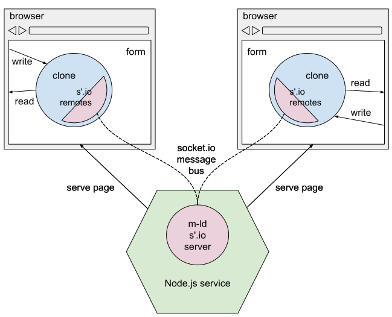

# m-ld-web-starter

_Starter project for web apps using **m-ld** and Javascript_

This app demonstrates using **m-ld** to enable collaborative form-filling in a
web app.

Note there are two branches to reflect versions of **m-ld**: `main` uses the
latest release; `edge` uses the latest pre-release with forthcoming features.
See the [**m-ld** GitHub project](https://github.com/orgs/m-ld/projects/4) for
feature status.

## running the app

1. Install [Node.js](https://nodejs.org/)
1. Clone this repository
1. In the project root, install dependencies with `npm install`
1. Build the project with `npm run build`
1. Run the server with `node index.js`
1. In a browser, navigate to http://localhost:3000/

## walkthrough

On the app homepage, you are asked to provide a form name to create or edit.
This name will be the sharable identity of the form-filling session.

Having entered a valid form name, you are presented with the form to fill out.
The form represents a kind of invoice, with 'parties' (each having a name), and
a list of 'items' (having a product code, quantity, stock quantity and price).

At any time, you can choose to go to the same form on a different browser tab,
or even in a different browser. You will see that both browser pages have the
same content, and they stay in sync when you make further edits.

> In this starter project, the form contents are **not** stored on the server.
> If no-one has the form open in a browser, the contents are gone.

## architecture

Like all apps using **m-ld**, each instance of the app (in the browser page)
has a _clone_ of the _domain_ of data, in this case, some form contents. There
can be any number of clones, all of which can read and write the data locally,
and **m-ld** takes care of synchronising all the clones.

This app makes the following choices for configuring **m-ld**.

- Clones use in-memory storage (no persistent storage).
- Communication between clones uses [Socket.io](https://socket.io/).

> **m-ld** is **not** inherently a client-server technology. We are
> running a server for this app for a couple of reasons:
>
> 1. To serve the page HTML and Javascript.
> 1. To pass messages between the clones via Socket.io.

## code structure

- The server code is in [`index.js`](./index.js).
- The landing page is [`index.html`](./index.html).
- The form page is [`form.html`](./form.html).
- The Javascript for the form page is [`form.js`](./form.js), which is bundled
  in the build step using [Browserify](https://browserify.org/) to `bundle.js`.

## enhancements

There are many possible changes we could make to this app; it's very unlikely
that a production app would do things so simply. **m-ld**
would also work in a more sophisticated environment using any choice of
front-end and back-end architecture, or even fully peer-to-peer with no servers
at all.

Here are some basic things to consider:

1. The form data could be persisted, even during editing, in browser persistent
   storage, or by having another clone on the server (not just a passive message
   passing service). This would mean it's possible to look at an existing form
   even if no-one else is.
1. Clustering the server would provide improved resilience. The Socket.io
   service can be clustered, but it might be better to instead use a reliable
   cloud messaging service like
   [Ably](https://js.m-ld.org/#ably-remotes). (There's no reason that the
   messaging service has to be part of the application server.)
1. Securing this web app against various attacks could include TLS for the page
   delivery and the Socket.io channels (confidentiality); authentication of the
   users and token-based access to the Socket.io channels (confidentiality,
   integrity & availability); and encryption of data in storage (if persisted).
   Note that we are actively
   [researching](https://github.com/m-ld/m-ld-security-spec) security for
   **m-ld** apps and we would love to have your input!